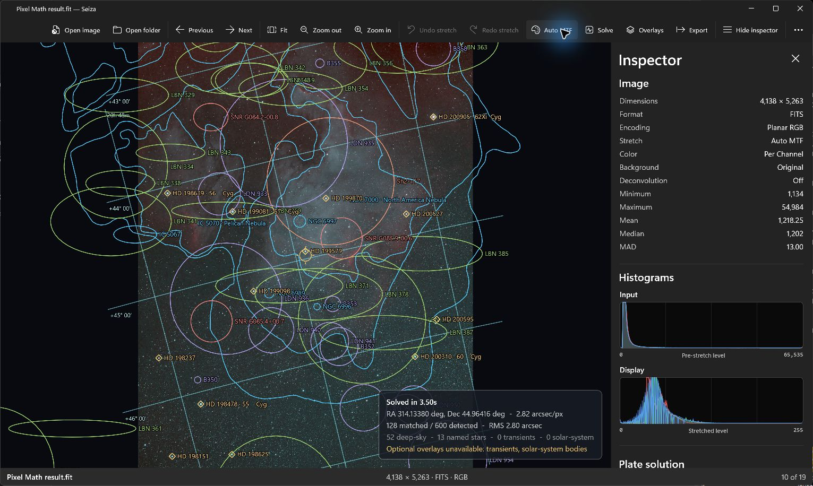
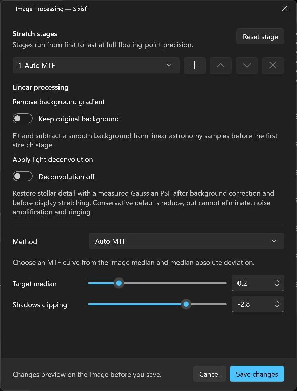
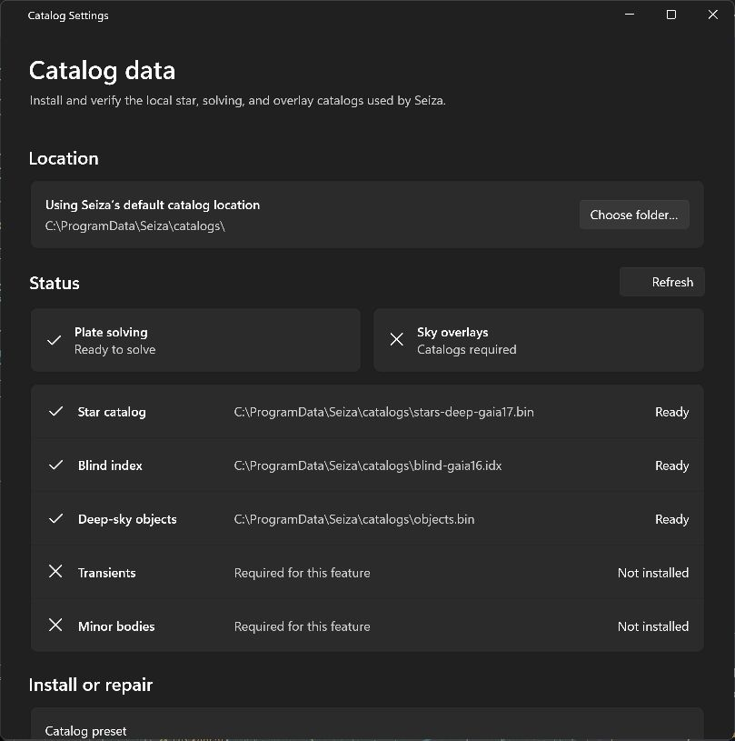

# Seiza for Windows

Seiza is a fast, native Windows astronomy image viewer and plate-solving app.
It combines a modern WinUI 3 interface and GPU-backed viewport with the same
Rust image, catalog, and solving core used by Seiza on macOS.



## What it can do

- Open FITS, XISF, PNG, JPEG, and TIFF images, folders, or dropped files; navigate
  naturally sorted image sets without blocking the UI.
- Fit, pan, and zoom a GPU-backed high-resolution viewport while overlay
  strokes, markers, and labels remain visually stable.
- Stretch FITS and XISF data with Auto MTF, GHS, Percentile Asinh, Linear, Asinh,
  explicit MTF, or no stretch; stack and reorder stages with live previews,
  undo, and redo.
- Process linear astronomy data with background-gradient removal, three color
  strategies, and conservative Richardson-Lucy deconvolution.
- Inspect image statistics, input/display RGB histograms, searchable source
  headers, processing provenance, and plate-solution quality.
- Blind-solve locally using downloaded catalogs, then draw a WCS grid, field
  center, named and field stars, deep-sky catalog objects and contours,
  transients, and solar-system motion overlays when their catalogs are present.
- Export the full-resolution stretched image as PNG, JPEG, or TIFF, either
  clean or composited with the currently visible overlays.
- Download, verify, repair, and relocate Seiza catalogs from the native
  Catalog Settings window.

| Astronomy processing | Catalog management |
| --- | --- |
|  |  |

The maintained [feature-parity matrix](docs/FEATURE_PARITY.md) records the
remaining macOS and Windows integration work.

## Install

Install the x64 MSI from a release or CI artifact. It installs Seiza for every
user into `Program Files\Seiza for Windows`, adds a shared Start Menu shortcut,
and registers `.fit`, `.fits`, `.fts`, and `.xisf` with Windows Default Apps.

The MSI is fully self-contained. It includes .NET 10, the Windows App SDK/WinUI
runtime, Win2D, and the pinned Seiza Rust core, so installation and first launch
do not download or bootstrap a separate runtime. Windows will request
administrator approval because this is an all-users installation.

The current target is Windows 11 24H2 or newer on x64. Release signing is still
on the roadmap; CI-built development installers are unsigned.

## Build and test

Install:

- Visual Studio with the **WinUI application development** workload
- .NET 10 SDK
- Rust 1.89 or newer with the `x86_64-pc-windows-msvc` target

Then build the app and native core:

```powershell
.\scripts\build-rust.ps1 -Test
dotnet build Seiza.slnx
```

Build the self-contained all-users WiX MSI:

```powershell
dotnet build packaging\windows\Seiza.App.wixproj `
  -c Release `
  -p:SeizaVersion=1.0.0
```

The installer is written to `dist`. See the
[installer notes](packaging/windows/README.md) for its layout and smoke test.

## Architecture

WinUI 3 and C# own Windows lifecycle, controls, accessibility, and settings.
Win2D owns interactive image and vector-overlay presentation. The exact pinned
upstream `seiza-cabi` Rust crate owns decoding, FITS/XISF processing, statistics,
catalogs, WCS, and solving; its version and 40-character source commit are
shown in the About dialog.

See [Architecture](docs/ARCHITECTURE.md) for component boundaries and
performance rules.
