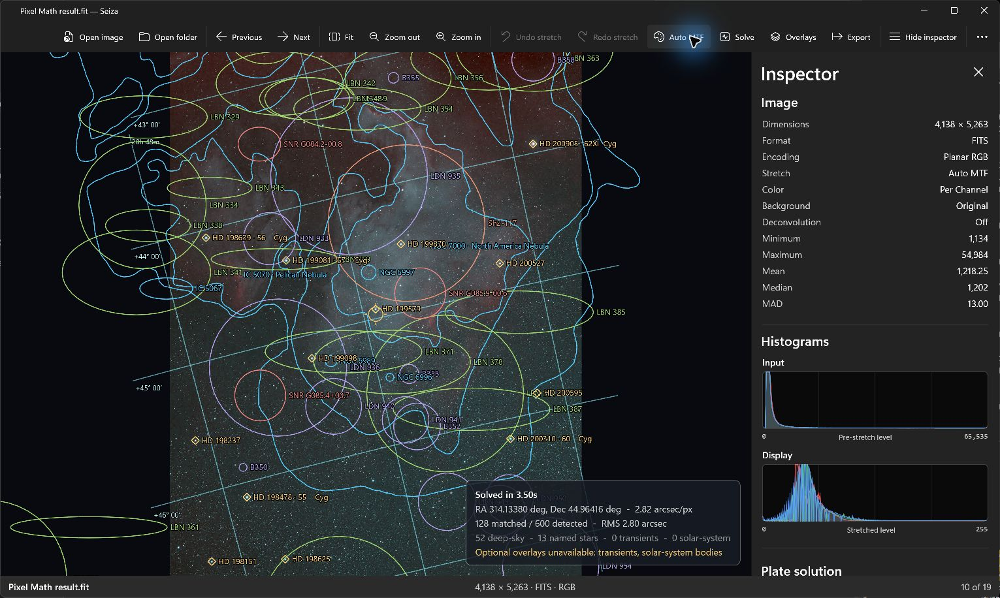
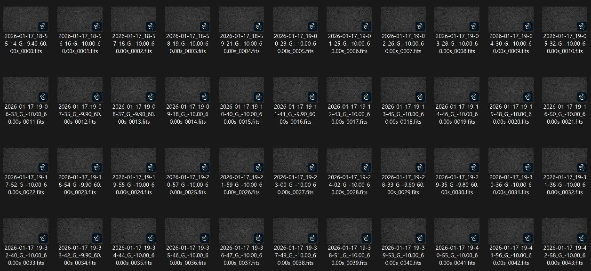
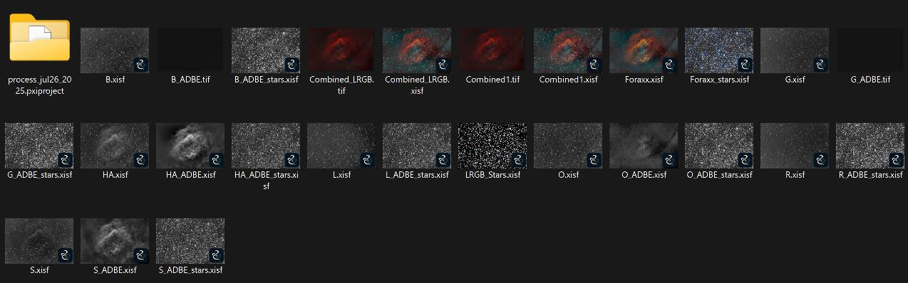
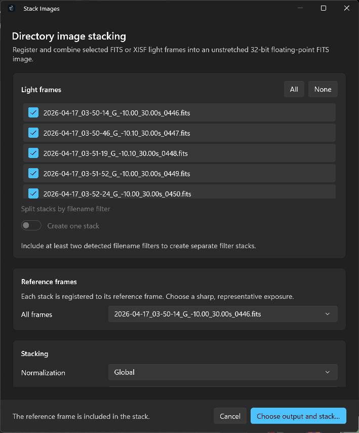
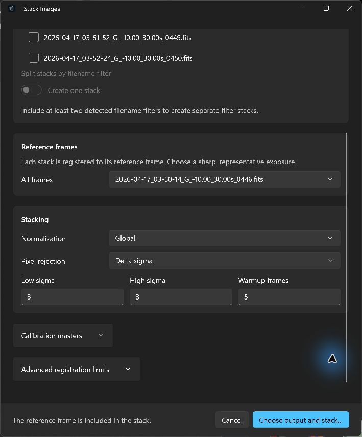
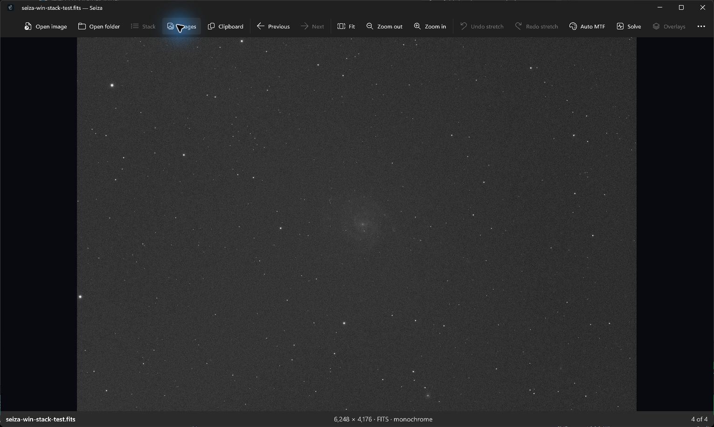
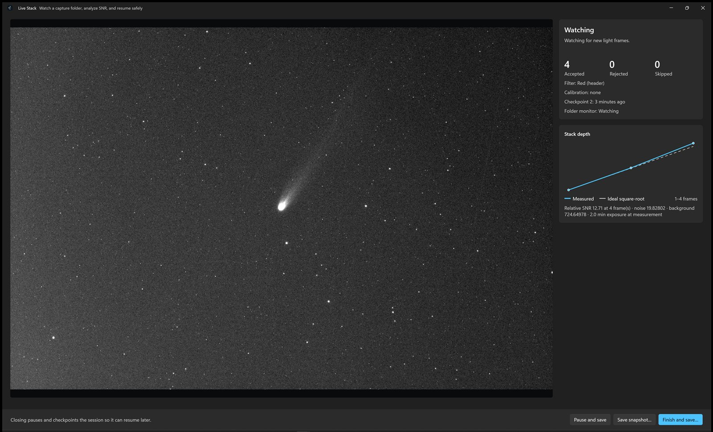
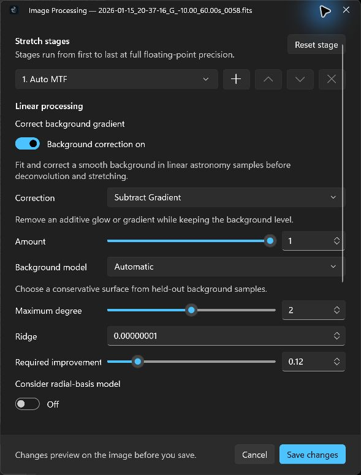
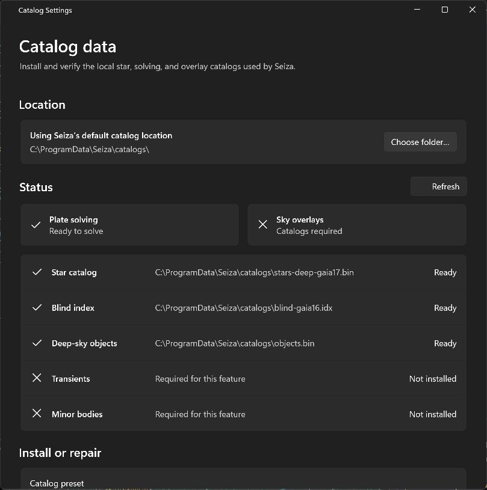

# Seiza for Windows

Seiza is a fast, native Windows astronomy image viewer and plate-solving app.
It combines a modern WinUI 3 interface and GPU-backed viewport with the shared
[Seiza](https://github.com/theatrus/seiza) Rust image, catalog, and solving
core.

[Download Seiza 0.6.1 for Windows (x64)](https://github.com/theatrus/seiza-win/releases/download/v0.6.1/seiza-0.6.1-windows-x86_64.msi)
· [Release notes and previous versions](https://github.com/theatrus/seiza-win/releases)

**Also from Seiza:** [Core, CLI, and libraries](https://github.com/theatrus/seiza) ·
[Seiza for Mac](https://github.com/theatrus/seiza-mac)



## Development highlights

This work will ship in the next Windows release. The stable download above
remains Seiza 0.6.1.

- Upgrade the native processing core to Seiza 0.18.4 for resumable live-stack
  checkpoints, calibration planning and master construction, native SNR
  measurements, and bounded preview and export support.
- Add an explicit **Analyze stars** action for FITS and XISF images. This is
  independent of plate solving and catalog downloads: the native core decodes
  the source file directly, measures HFR/FWHM, and returns a nine-cell sensor
  tilt summary. The Windows inspector and overlay menu keep these measured
  stars distinct from plate-solve detections.

The star-analysis work is an unreleased development highlight. Its local
feature build has been exercised end to end with real FITS and XISF telescope
data; it still depends on the corresponding upstream Seiza C ABI being
published and Cargo-locked here before it is part of the stable download. Its
measured-star circles and sensor-tilt grid use the
same image-space overlay scene for the live viewport and full-resolution 8- or
16-bit composited export. Direction lines remain hidden unless the native
response explicitly guarantees normalized major-axis orientations; sparse
grid cells are labeled as low-sample, and tilt should be confirmed across
multiple frames rather than inferred from one exposure.

## Native Explorer previews and thumbnails

The all-users MSI registers Seiza's native thumbnail and Preview Pane providers
for `.fit`, `.fits`, `.fts`, and `.xisf`. Explorer hosts them in isolated shell
processes; neither component loads WinUI, .NET, catalogs, or solving code.
Thumbnail and preview rendering is bounded for large inputs, and install,
repair, and uninstall notify the shell immediately so associations refresh
without a Windows restart.

| FITS capture sequence | XISF processing folder |
| --- | --- |
|  |  |

## Directory image stacking

- Directory image stacking registers and combines selected FITS or XISF
  light frames into an unstretched 32-bit floating-point FITS image.
- Stacks can be split automatically by filename filter, with an independent
  reference frame for each filter group. Global or local normalization,
  delta-sigma rejection, registration limits, and calibration match the macOS
  workflow. Choose existing masters or point Seiza at raw bias, dark,
  dark-flat, and flat frames; the shared core matches camera metadata and
  proves one safe calibration set against every target light in each group
  before building the dependency chain. Matching uses target, proximity,
  alternate-anchor, and coherent session passes; a recognized filename filter
  can identify a target light whose FILTER header is missing, while an
  unresolved target filter withholds flat calibration. Final native admission
  reports every accepted input and every skipped input with its reason, and
  Windows verifies that provenance before publishing or caching a master.
  Windows then rechecks the written master so its preserved sensor and optics
  metadata must still match every target light. A selected frame that cannot
  be inspected, or that is not a raw light — a master, or an already
  calibrated file — is set aside from matching with a warning; the stack
  still runs, and native per-frame admission decides that frame's fate. Seiza names the readings
  behind a refusal, accepts realistic rotator re-homing scatter with a
  2-degree default tolerance, and
  validates each future light against the active calibration epoch rather than
  judging a master swap against the already-integrated reference.
- Stacking runs off the UI thread with per-frame progress, accepted/rejected
  counts, cancellation between frames, and automatic opening of the result.
  Measurements at progressively deeper checkpoints show SNR and achieved
  noise reduction without copying the accumulator.

Open a folder containing FITS or XISF light frames, then choose **Stack** from
the toolbar. Select the exposures to include and a reference frame, then tune
normalization, pixel rejection, registration limits, or optional calibration
masters. When filenames contain multiple filter names, Seiza enables a
separate output per filter by default so incompatible channels are not mixed.

| Frame and reference selection | Registration and rejection controls |
| --- | --- |
|  |  |

Seiza reports per-frame progress without blocking the viewer, writes an
unstretched 32-bit floating-point FITS result, and opens the completed stack
automatically. Completed files are published atomically, so a failed or
cancelled write cannot replace an existing output with a partial file. Seiza
also validates every output in a multi-filter batch before stacking begins and
identifies any files that were already saved if a later stack is cancelled.



## Live folder stacking

Choose **Live Stack** to watch a capture folder while an imaging session is in
progress. Seiza waits until each FITS or XISF file has stopped changing, checks
that it is a raw, compatible light frame, revalidates it against the active
masters, and registers it into a filter-locked stack. File-system notifications
keep the display responsive, while periodic full reconciliation catches files
that arrived while the folder or watcher was unavailable.

The live window provides a bounded autostretched preview, accepted/rejected
counts, calibration epochs, checkpoint health, and an SNR chart with measured
noise, background, and cumulative exposure when the headers provide it. You
can save a non-destructive FITS snapshot at any time or finish the accumulator
to publish the final 32-bit floating-point FITS stack.

Live sessions checkpoint the exact registration, normalization, rejection,
calibration, and source-ledger state. **Pause and save** makes the session
resumable; startup validates the newest native context and manifest together
and can fall back to the previous complete generation after an interrupted
write. Existing or automatically built masters can be applied atomically as a
new calibration epoch. Selecting no new calibration while resuming preserves
the masters recorded in the checkpoint.



## Signed updater and installer

Seiza 0.1.3 established the signed in-app updater and fixed the installer's
post-install launch behavior:

- Fixed the installer's selected-by-default **Launch Seiza** action so Finish
  opens the installed app in the signed-in user's desktop session.
- The launch now uses WiX's unelevated shell action with the app's full
  installed path instead of a directory-relative executable command.
- Installed copies can discover, verify, and install later releases from
  **More > Check for updates** or **Settings > Check now**.

Other preview highlights still apply:

- GPU-backed FITS and XISF viewing with a cached thumbnail browser and
  image-anchored pan, wheel zoom, and pinch zoom.
- Seven stretch models, ordered adjustment stages, RGB strategies, automatic
  and manual background correction, live histograms, and Richardson-Lucy
  deconvolution.
- Local plate solving with WCS grids, deep-sky contours, named and field stars,
  transients, solar-system objects, and motion vectors.
- Full-resolution clean or overlay-composited export, FITS WCS sidecars, and
  image or processing-adjustment copy/paste.
- Native catalog download, verification, repair, and relocation UI.
- A self-contained, all-users MSI with FITS and XISF Windows file associations.

## What it can do

- Open FITS, XISF, PNG, JPEG, and TIFF images, folders, or dropped files; browse
  naturally sorted image sets in a cached thumbnail rail without blocking the UI.
- See autostretched FITS and XISF content thumbnails directly in Windows File
  Explorer after installing Seiza, and select a file to inspect the stretched
  image in Explorer's Preview Pane without opening the app.
- Work in multiple independent document windows. Reopening an already-open
  file focuses its window, while additional file activations stay in the same
  Seiza process and open a new document window.
- Register and stack selected FITS or XISF frames from an opened folder, with
  optional per-filter outputs, existing or automatically built calibration
  masters, normalization, pixel rejection, reference selection, SNR analysis,
  progress, and cancellation.
- Watch a capture folder for stable FITS/XISF lights, inspect a bounded live
  preview and depth curve, save snapshots, and pause or resume the exact stack
  from crash-safe checkpoints.
- Fit, pan, wheel-zoom, and pointer-anchored pinch-zoom a GPU-backed
  high-resolution viewport. Overlay geometry and labels stay registered to image
  pixels while line weights remain readable.
- Stretch FITS and XISF data with Auto MTF, GHS, Percentile Asinh, Linear, Asinh,
  explicit MTF, or no stretch; stack and reorder stages with live previews,
  undo, and redo.
- Correct additive gradients or multiplicative illumination with adjustable
  strength and automatic, polynomial, or radial-basis background models; the
  flexible radial-basis option includes an extended-detail warning and is
  opt-in during automatic selection.
- Process linear astronomy data with three color strategies and conservative
  Richardson-Lucy deconvolution.
- Inspect image statistics, input/display RGB histograms, searchable source
  headers, processing provenance, and plate-solution quality.
- Blind-solve locally using downloaded catalogs, then draw a WCS grid, field
  center, named and field stars, deep-sky catalog objects and contours,
  transients, and solar-system motion overlays when their catalogs are present.
- Start solving from either the toolbar or the inspector, and export a solved
  TAN/TAN-SIP header as a standards-compatible FITS `.wcs` file.
- Export the full-resolution stretched image as PNG, JPEG, or TIFF, either
  clean or composited with the currently visible overlays. FITS and XISF can
  be written as true 16-bit-per-channel PNG or TIFF without passing through the
  8-bit display bitmap.
- Copy and paste rendered images or a versioned set of Seiza processing
  adjustments through the Windows clipboard.
- Download, verify, repair, and relocate Seiza catalogs from the native
  Settings window. The recommended preset includes deep-sky objects,
  transients, and solar-system bodies as well as solving data.
- Check the signed Sparkle feed automatically or on demand, then download,
  verify, and open an in-place MSI update without visiting the Releases page.

| Astronomy processing | Catalog management |
| --- | --- |
|  |  |

The maintained [feature-parity matrix](docs/FEATURE_PARITY.md) records the
remaining macOS and Windows integration work.

## Install

Download the [Seiza 0.6.1 x64 MSI](https://github.com/theatrus/seiza-win/releases/download/v0.6.1/seiza-0.6.1-windows-x86_64.msi).
Its [SHA-256 checksums](https://github.com/theatrus/seiza-win/releases/download/v0.6.1/SHA256SUMS.txt)
are published beside it. The installer places Seiza in
`Program Files\Seiza for Windows` for every user, adds a shared Start Menu
shortcut, and registers `.fit`, `.fits`, `.fts`, and `.xisf` with Windows
Default Apps. It also installs native Explorer thumbnail and Preview Pane
providers for those astronomy formats.

The MSI is fully self-contained. It includes .NET 10, the Windows App SDK/WinUI
runtime, Win2D, and the Cargo-locked Seiza Rust core, so installation and first
launch do not download or bootstrap a separate runtime. Windows will request
administrator approval because this is an all-users installation.

System requirements are Windows 11 24H2 or newer on an x64 computer. The MSI
and bundled first-party binaries are Authenticode signed by StackFoundry LLC.
The in-app updater also uses independent Ed25519 signatures to verify its feed
and MSI download.

## Build and test

Install:

- Visual Studio with the **WinUI application development** workload
- .NET 10 SDK
- Rust 1.89 or newer with the `x86_64-pc-windows-msvc` target

Then build the app and native core:

```powershell
.\scripts\build-rust.ps1 -Test
dotnet build Seiza.slnx
```

Build the self-contained all-users WiX MSI:

```powershell
dotnet build packaging\windows\Seiza.App.wixproj `
  -c Release `
  -p:SeizaVersion=0.6.1
```

The installer is written to `dist`. See the
[installer notes](packaging/windows/README.md) for its layout and smoke test.
The maintainer [release guide](docs/RELEASING.md) covers versioning, validation,
tagging, publication, and recovery. The [signed update guide](docs/AUTO_UPDATE.md)
documents the updater trust model and appcast generation.

## Architecture

WinUI 3 and C# own Windows lifecycle, controls, accessibility, and settings.
Win2D owns interactive image and vector-overlay presentation. The published
`seiza-cabi` Rust crate and its crates.io dependencies own decoding, FITS/XISF
processing, statistics, catalogs, WCS, and solving. `Cargo.lock` selects exact
versions, and the About dialog reports the C ABI version and packaged source
commit. A separate native Rust COM DLL renders FITS/XISF thumbnails and Preview
Pane images inside Windows' isolated shell-extension hosts; it does not load
WinUI, .NET, catalogs, or solving code.

See [Architecture](docs/ARCHITECTURE.md) for component boundaries and
performance rules.
