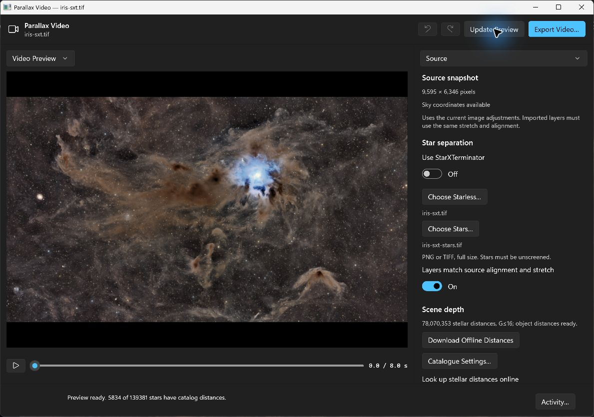

# Parallax video on Windows

The Windows editor follows the feature set in
[Seiza for macOS PR #56](https://github.com/theatrus/seiza-mac/pull/56), with native
WinUI controls and Windows video encoding. Scene preparation, depth assignment,
camera fitting, tour planning, labels, dust and frame rendering remain in the
shared Seiza Rust core; Windows does not reproduce those pixel algorithms.



## Workflow

Open an image and choose **Parallax Video**. The generator owns an independent
snapshot of the document's committed image-processing settings. Subsequent
viewer navigation does not change its source. Astronomy sources are rendered
through the shared processing pipeline into a temporary display-image snapshot;
the original FITS/XISF file is not modified. Already-rendered raster images use
Windows image codecs to make a lossless 16-bit PNG snapshot, normalizing EXIF
orientation without passing through the viewer's eight-bit display bitmap.

1. In **Source**, configure star separation and scene depth. Use a locally
   installed RC-Astro CLI (`rc-astro.exe`) licensed for StarXTerminator, or
   choose aligned starless/stars layers. Manual layers must have the source
   dimensions, matching orientation and stretch; confirm their alignment
   before preparation. Neither RC-Astro's CLI nor StarXTerminator is bundled
   or installed by Seiza. If the source has no existing plate solution,
   manual-layer preparation and tour generation solve the selected stars layer,
   including when the viewer contains the starless image.
2. In **Camera**, choose **Fly In** or **Tour**. Pick destinations on the image
   or enter source-pixel coordinates. Prepare a bounded preview, scrub or play
   it, then adjust the camera. Camera-only edits reuse the prepared scene;
   scene changes require preparation again.
3. In **Labels**, configure object labels, custom point/radius labels, label
   colour and an optional credit.
4. In **Output**, choose dimensions, frame rate, native codec and render
   quality, then **Export Video**. Export fits the full-resolution camera and
   renders its frames independently of the smaller interactive preview.

## Feature parity

The editor exposes the same composition controls as the Mac implementation:

- Fly-in timing, start framing, dolly, pan, opening/end zoom, start/end roll,
  sideways swing and direction, and easing.
- Automatic tours with target count, hold and motion controls; editable stops
  with point/whole-image focus, travel and hold, zoom, dolly, pan, roll, spin,
  push and optional titles; stop insertion, duplication, reordering and removal.
- Tour glide, titles, looping and JSON itinerary load/save. Shared schema-1
  itineraries remain portable; an itinerary is not a complete project archive
  and does not embed source images or separated layers.
- Distance reference, explicit background/unmatched-star distances, optional
  online stellar distances, Gaia magnitude depth and optional distance/object
  input files.
- Moving-star limit, remaining-star policy, background galaxies, dust dimming,
  star growth/fade controls, catalogue/custom labels and credit.
- Undo/redo, fitted-camera warnings, bounded automatic camera previews,
  timeline playback, progress/activity reporting and cancellation.

Windows uses native file pickers and reveals a completed export in Explorer.
Platform-specific application chrome and encoder availability differ from
macOS; the shared scene and camera semantics do not.

## Offline distances

**Download Offline Distances** selects exactly these published datasets:

- `star-distances.bin`
- `object-distances.bin`
- `objects.bin`

This is a focused download, not the solver's **Everything** preset. It does not
fetch the optional G≤20 star catalogue. Solving catalogues still need to be
available when an image needs solving; installed distance data does not replace
them. The displayed stellar magnitude coverage comes from the native database
header. Default-directory status follows the shared core's environment overrides
and legacy fallback paths; an explicitly selected directory is checked as-is.
Choosing a deeper Gaia limit than that coverage produces a warning.
Object-distance readiness also requires a readable, fingerprint-matched
`objects.bin`. Missing or corrupt pinned environment overrides show their actual
path and variable; downloading to another directory cannot repair those choices.

The platform adapter delegates manifest loading, transfer, decompression,
SHA-256 checks and installation to the published `seiza-download` crate. It
explicitly re-verifies cache hits. A checksum/size failure can evict only the
failed selected cache file, after checking its expected metadata and canonical
cache-directory containment, and then reacquire it through the downloader.
Other cache files and installed source data are not cleared. Each selected
artifact gets at most one repair attempt per download operation; persistent
failure is reported rather than retried indefinitely.

## Native video export and safety

Movies are silent SDR MP4 files, encoded through Windows Media Foundation's
WinRT `MediaStreamSource`/`MediaTranscoder` APIs. H.264 and HEVC are available as
choices, with hardware acceleration allowed. HEVC requires an encoder available
to the Windows media stack; if unavailable, Seiza reports the failure and
suggests H.264 rather than downloading a codec or using an external encoder.

The export limits match the Mac implementation: even width/height from 16 to
3840 pixels, 1–60 frames per second and 2–36,000 frames. Bitrate is at least
2 Mbit/s, otherwise width × height × FPS ÷ 2. Input/output colour metadata uses
Rec.709 primaries/matrix with the source display pixels' sRGB transfer function.

Frames are rendered only when the encoder requests them. At most six reusable
BGRA buffers are allocated; a buffer is not reused until Windows reports its
sample processed. Timestamps derive from the rational frame index/FPS, avoiding
accumulated frame-duration rounding. Neither a movie-sized frame array nor a
directory of temporary frame images is created.

The encoder writes a unique sibling staging MP4 and closes/finalizes it before
atomically replacing the chosen destination. Cancellation or a render/encode
failure leaves an existing destination untouched and removes the staging file.
The Windows App SDK path-only save picker does not create or truncate the
destination before this staging operation.
Cancellation is connected to both the Windows async operation and blocked frame
production; callback work is joined before its native source is released. Some
synchronous core stages must finish their current call before closing completes.

## Validation

The Windows-runtime encoder tests produce and decode a real H.264 MP4, checking
dimensions, FPS, duration, exact encoded sample count, absence of audio, channel
colours, top-down frame orientation and the six-buffer bound. They also exercise producer exceptions,
already-cancelled work, cancellation after submission, and cancellation while
the media pipeline waits for a blocked producer, checking previous-output
preservation and staging cleanup. Rational timing and invalid limits are tested
separately. On a machine without HEVC, its actionable failure and output
preservation are tested instead of pretending an HEVC movie was encoded.

A native-core integration test prepares real `ParallaxVideo` handles from
deterministic separated PNGs and sends them through the production Windows
encoder overload, then decodes the movie and verifies source-file immutability.
An opt-in real-source test also prepares the supplied 9,595 × 6,346 Iris TIFF
layers entirely offline, exports and decodes a 1280 × 720, 48-frame H.264 movie
at 24 fps, and verifies SHA-256 hashes of every original source-folder file.
Diagnostic frames and movies are written outside the source folder. Raster
snapshot tests verify sub-eight-bit distinctions, TIFF/JPEG EXIF orientation and
collision refusal.

The same Iris layers were also imported, prepared, played and exported through
the native editor. The GUI-generated movie was independently decoded and checked
for 1280 × 720 dimensions, 48 H.264 frames at 24 fps, two-second duration, correct
orientation and no audio. This offline validation uses explicit illustrative
background/unmatched-star distances, not a downloaded per-star distance database.

The 0.8.0 manual-layer solving regression was also checked interactively with
the starless Iris TIFF open in the viewer and both aligned layers selected.
Preparation solved sky coordinates from the imported stars, detected 139,381
stars and matched 5,834 to the installed offline distance catalog. The independent
workspace remained usable after closing the source viewer.

Native adapter tests use local manifest/file fixtures without downloading data:
they check exact three-file selection, compressed progress accounting, missing
or corrupt database status, stellar header depth, cache re-verification,
targeted repair/recovery, concurrent-repair preservation and unrelated-file
protection. These automated checks complement, rather than replace, native UI
inspection and end-to-end export with real astronomy data.

```powershell
cargo test --package seiza-platform --release --locked
dotnet test tests\Seiza.App.Windows.Tests\Seiza.App.Windows.Tests.csproj -c Release
dotnet test tests\Seiza.App.Tests\Seiza.App.Tests.csproj -c Release
```

To include the opt-in real TIFF corpus (otherwise the real-source test is skipped):

```powershell
$env:SEIZA_PARALLAX_SOURCE_DIRECTORY = 'C:\Users\atrus\Dropbox\parallax\sources\iris'
$env:SEIZA_PARALLAX_OUTPUT_DIRECTORY = "$PWD\artifacts\parallax-real-qa"
dotnet test tests\Seiza.App.Windows.Tests\Seiza.App.Windows.Tests.csproj -c Release
```

`SEIZA_PARALLAX_EXISTING_MOVIE` separately enables the diagnostic for an existing
1280 × 720, 24 fps, two-second GUI H.264 export. That diagnostic is skipped when
the variable is unset and writes decoded previews to the output directory.
